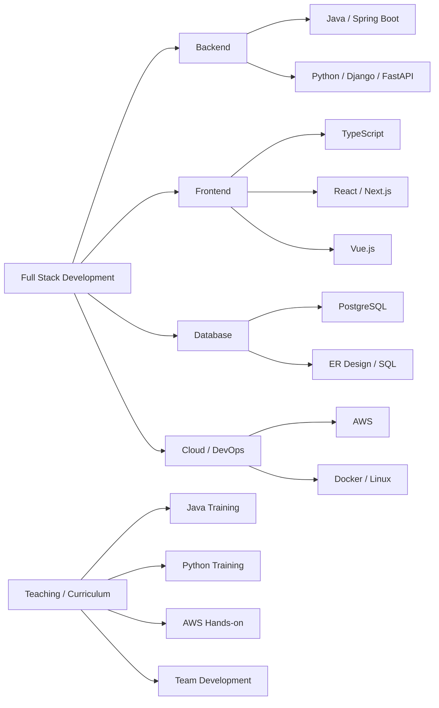
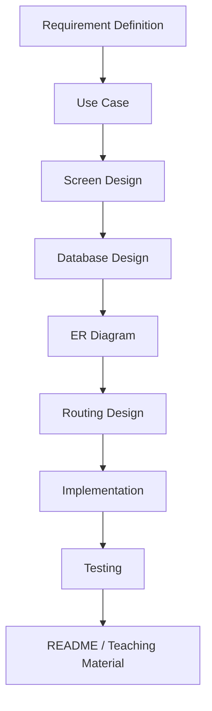
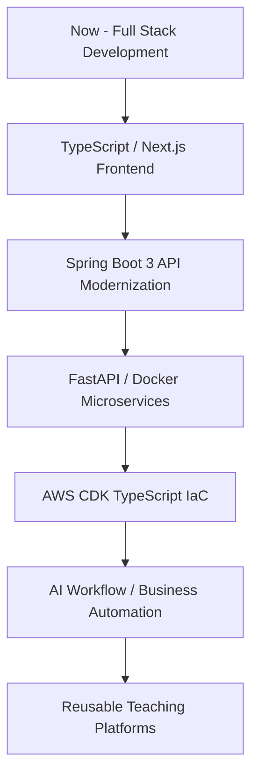

  

# yoshiayu

## 自己紹介 / About Me

### 日本語
Java / Spring Boot、Python / Django・FastAPI、TypeScript / React・Next.js・Vue.js を扱うフルスタックエンジニア兼プログラミング講師です。

バックエンド、フロントエンド、データベース、AWS、Docker、GitHub を横断しながら、業務システム開発・教育用教材制作・チーム開発指導を行っています。

特に、現場で使える実装力と、初学者にも伝わる教材設計の両立を重視しています。

### English
I am a full-stack engineer and programming instructor working with Java / Spring Boot, Python / Django・FastAPI, and TypeScript / React・Next.js・Vue.js.

I work across backend, frontend, databases, AWS, Docker, and GitHub, focusing on business application development, educational material creation, and team development training.

My core theme is to bridge practical engineering skills with clear, reusable educational content.

---

## Skills

---

## 技術スタック / Tech Stack

### Backend
- Java / Spring Boot 3
- Python / Django / FastAPI / Flask
- REST API
- Authentication / Session / CRUD / Search
- Web scraping / OCR / Automation tools

### Frontend
- HTML / CSS / JavaScript
- TypeScript
- React / Next.js
- Vue.js
- Thymeleaf
- Responsive UI design

### Database
- PostgreSQL
- MySQL
- SQLite
- ER diagram / Schema design
- SQL / CRUD / Search query design

### Infrastructure & DevOps
- AWS: EC2, S3, Lambda, DynamoDB, API Gateway, Route53, CloudFront
- Docker
- Linux: Amazon Linux, Ubuntu
- Git / GitHub / GitHub Organization
- CI/CD basics

### Tools
- VS Code
- IntelliJ IDEA
- Eclipse
- Postman
- Mermaid
- Draw.io
- Figma

---

## 主な開発領域 / Main Development Areas

---

## GitHub Statistics

---

## Trophy

---

## 活動内容 / Activities

### 日本語
- Java / Spring Boot、Python / Django、TypeScript / React・Next.js、AWS の授業・カリキュラム設計
- Spring Boot × PostgreSQL を使ったECサイト、予約システム、検索アプリの開発
- Django / FastAPI を使ったOCR、スクレイピング、業務効率化ツールの開発
- React / Next.js / Vue.js を使ったフロントエンド実装
- GitHub Organization を使った学生・社会人向けチーム開発指導
- ER図、ユースケース記述、画面設計、ルーティング設計、README整備

### English
- Designing and delivering curricula for Java / Spring Boot, Python / Django, TypeScript / React・Next.js, and AWS
- Developing EC, reservation, and search applications using Spring Boot × PostgreSQL
- Building OCR, scraping, and automation tools using Django / FastAPI
- Implementing frontend applications with React / Next.js / Vue.js
- Coaching team development using GitHub Organization
- Creating ER diagrams, use-case specs, screen flows, routing designs, and README documentation

---

## 代表的な開発テーマ / Representative Project Themes

### Web Application
- EC site
- Hotel reservation system
- Library management system
- Search application
- Inquiry management system
- Team development support tools

### Automation / AI / Data Processing
- Invoice OCR system
- Web scraping tools
- CSV / Excel export tools
- AI-assisted proposal generation workflow
- Business efficiency scripts

### Education / Training
- Java basic training
- Servlet / JSP training
- Spring Boot × PostgreSQL training
- Python / Django training
- AWS hands-on training
- Git / GitHub team development training

---

## 設計・ドキュメント / Design & Documentation

### 日本語
開発では、コードを書く前の設計を重視しています。  
画面、URL、Controller、Entity、Repository、DBテーブルの関係を整理し、初学者でも処理の流れを追える構成にすることを意識しています。

### English
I value design before implementation.  
I organize screens, URLs, controllers, entities, repositories, and database tables so that even beginners can understand the application flow clearly.

---

## 現在強化している領域 / Current Focus

### 日本語
- TypeScript を中心としたフロントエンド開発
- Next.js / React によるモダンWebアプリ開発
- Spring Boot 3 × PostgreSQL の実務寄り教材化
- FastAPI × Docker によるAPI開発
- AWS CDK / TypeScript によるIaC
- AIワークフローと業務システムの連携

### English
- Frontend development centered on TypeScript
- Modern web application development with Next.js / React
- Practical training materials using Spring Boot 3 × PostgreSQL
- API development with FastAPI × Docker
- IaC using AWS CDK / TypeScript
- Integration of AI workflows with business applications

---

## Development Roadmap

---

## Contribution Snake

<picture>
  <source
    media="(prefers-color-scheme: dark)"
    srcset="https://raw.githubusercontent.com/yoshiayu/yoshiayu/output/github-contribution-grid-snake.svg"
  />
  <source
    media="(prefers-color-scheme: light)"
    srcset="https://raw.githubusercontent.com/yoshiayu/yoshiayu/output/github-contribution-grid-snake.svg"
  />
  
</picture>

---

## Final Note / 最後に

### 日本語
私は、フルスタック開発・教育・教材制作を軸に、作って終わりではなく、実務で使える形まで整理し、さらに人に伝わる形へ落とし込むことを大切にしています。

コード、設計、ドキュメント、教育をつなげながら、現場でも学習の場でも再利用できる開発資産を積み上げています。

### English
My work is built around full-stack development, teaching, and educational material creation.

I do not stop at simply building applications. I focus on organizing them into practical, reusable, and teachable assets that can be used both in real projects and in learning environments.
