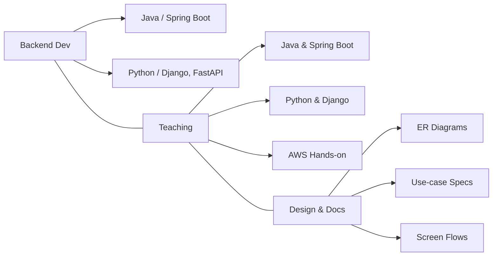
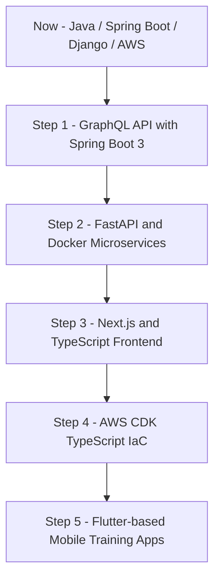

  

,,

## Stats

## Trophy

# yoshiayu

## 自己紹介 / About Me

日本語  
Java / Python を中心としたバックエンドエンジニア兼プログラミング講師です。  
「現場でそのまま使えるコード」と「教育として機能する教材」の両立をテーマに、  
専門学校での授業・企業向けツール開発・教材制作を並行して行っています。

English  
I’m a backend engineer and programming instructor focused on Java and Python.  
My main theme is to bridge **production-ready code** and **educationally effective materials**,  
working across vocational school teaching, tool development for clients, and curriculum design.

---

## 技術スタック / Tech Stack

日本語  
**Backend**  
- Java（Spring Boot 3）  
- Python（Django / FastAPI）

**Frontend**  
- HTML / CSS / JavaScript  
- TypeScript  
- Vue.js / Next.js

**Database**  
- PostgreSQL / MySQL / SQLite  

**Infrastructure & DevOps**  
- AWS（EC2, S3, Lambda, DynamoDB, API Gateway, Route53）  
- Docker / Linux（Amazon Linux, Ubuntu）

**Tools**  
- Git / GitHub  
- VS Code / IntelliJ IDEA  
- Postman / Mermaid / Draw.io  

English  
**Backend**  
- Java (Spring Boot 3)  
- Python (Django / FastAPI)

**Frontend**  
- HTML / CSS / JavaScript  
- TypeScript  
- Vue.js / Next.js

**Database**  
- PostgreSQL / MySQL / SQLite  

**Infrastructure & DevOps**  
- AWS (EC2, S3, Lambda, DynamoDB, API Gateway, Route53)  
- Docker / Linux (Amazon Linux, Ubuntu)

**Tools**  
- Git / GitHub  
- VS Code / IntelliJ IDEA  
- Postman / Mermaid / Draw.io  

---

## 全体像（Mermaid ダイアグラム） / Overview (Mermaid Diagram)

日本語  
自分の活動領域をざっくり図にするとこんなイメージです。

English  
Here’s a high-level overview of my main activity areas using Mermaid.

## GitHub 統計 / GitHub Statistics
### 日本語
### GitHub の自動集計ベースでは、主に以下の言語を多く扱っています。
 - Python：OCR / 検索アプリ / 自動化ツール / 教材
 - Java：Spring Boot 教材 / EC サイト / 予約システム
 - JavaScript / TypeScript：Vue / Next.js
 - HTML / CSS：授業用サンプル・静的サイト
 - Swift：iOS / SwiftUI の教材
### English
### According to GitHub’s language statistics, I mainly work with:
 - Python: OCR, search apps, automation tools, educational repos
 - Java: Spring Boot training, EC sites, reservation systems
 - JavaScript / TypeScript: Vue and Next.js frontends
 - HTML / CSS: educational samples and static sites
 - Swift: iOS / SwiftUI training apps

   

活動内容 / Activities

### 日本語
 - Java / Spring Boot, Python / Django, AWS の授業・カリキュラム設計
 - 授業用サンプルアプリ（EC / 予約 / 検索 / 問い合わせ管理 など）の開発
 - 請求書 OCR、スクレイピング、自動化スクリプトなどのツール開発
 - 学生・社会人向けのチーム開発指導（GitHub ベース）

### English
 - Design and delivery of Java / Spring Boot, Python / Django, and AWS curricula
 - Building educational sample apps (EC, reservation, search, inquiry management, etc.)
 - Tool development such as invoice OCR, scraping, and automation scripts
 - Team development coaching for students and professionals using GitHub

 
詳しい活動内容 / More details

### 日本語
 - 前期：Java 基礎 ～ サーブレット ～ 簡易 Web アプリ
 - 後期：Spring Boot × PostgreSQL で本格的な CRUD / 検索 / 認証
 - Python：Django で検索アプリ／イベントアプリ／API 連携など
 - AWS：EC2 / S3 / Lambda / DynamoDB / Route53 をハンズオン形式で指導

### English
 - First semester: Java basics → Servlet → simple web apps
 - Second semester: Spring Boot × PostgreSQL with full CRUD, search, and auth
 - Python: Django-based search apps, event apps, and API integrations
 - AWS: Hands-on training with EC2, S3, Lambda, DynamoDB, and Route53

代表的な ER 図・設計資料 / Representative ER Diagrams & Design Docs

### 日本語
 - EC サイト：会員／商品／購入履歴／お気に入り／通報／チャット
 - 予約システム：ホテル／予約／ユーザー／お気に入り
 - 図書館アプリ：蔵書／利用者／貸出／返却
 - 画面遷移図、ユースケース記述、スキーマ設計まで一式を GitHub で公開

### English
 - EC site: Members / Products / Purchase history / Favorites / Reports / Chat
 - Reservation system: Hotels / Reservations / Users / Favorites
 - Library app: Books / Users / Loans / Returns
 - Full sets of screen flows, use-case specs, and schema designs are available in my repositories

## 案件実績・請負開発 / Contract Work & Client Projects

### 日本語
 - 請求書 OCR × Django：中小企業向けの文書処理自動化
 - Web スクレイピング＋データ加工ツール：メディア・広告関連
 - Spring Boot × AWS：観光業向け予約管理システム
 - 各種 API 連携ツール、業務効率化スクリプトの作成

### English
 - Invoice OCR × Django: Document processing automation for SMEs
 - Web scraping and data processing tools for media/advertising clients
 - Spring Boot × AWS: Reservation management system for tourism services
 - Various API integration tools and automation scripts for business workflows

## 講師としての理念・教育方針 / Teaching Philosophy

### 日本語
 - 「知識よりも、現場で使えるスキル」を最優先にする
 - 小さな成功体験を積み重ねて、継続できる学習サイクルを作る
 - 教材・サンプル・演習を一貫して自作し、再利用しやすい形で GitHub に蓄積
 - 初学者・女性・社会人リスキリング層にも開かれたクラス設計を心がける

### English
 - Prioritize “skills you can use in the real world” over raw knowledge
 - Build a learning cycle that is sustainable through many small wins
 - Create and version-control all materials, samples, and exercises on GitHub for reuse
 - Design classes that are inclusive for beginners, women, and career-change learners

## 今後のロードマップ / Development Roadmap

### 日本語
 - GraphQL × Spring Boot 3 による API 層のモダナイズ
 - FastAPI × Docker でのマイクロサービス教材化
 - Next.js × TypeScript によるフロントエンド統一
 - AWS CDK（TypeScript）を使った IaC 教材作成
 - Flutter を使ったモバイルアプリ教材の整備

### English
 - Modernize API layers using GraphQL × Spring Boot 3
 - Build microservice training materials with FastAPI × Docker
 - Standardize frontend stack with Next.js × TypeScript
 - Create IaC training content using AWS CDK (TypeScript)
 - Develop a unified mobile curriculum using Flutter

## ロードマップ（Mermaid） / Roadmap (Mermaid)

### 日本語
#### ざっくりとした技術ロードマップを Mermaid で表現しています。

### English
#### Here is a rough technical roadmap visualized with Mermaid.

## リポジトリ言語別サマリー / Repository Summary by Language

### 日本語
#### おおよそのパブリックリポジトリの内訳です（目安）。
| 言語                              | 件数（おおよそ） |
| ------------------------------- | -------- |
| Python                          | 約 28     |
| Java                            | 約 22     |
| JavaScript / TypeScript         | 約 12     |
| HTML / CSS                      | 約 8      |
| Swift                           | 約 4      |
| その他（Shell, Dockerfile, YAML など） | 約 8      |

### English
### Approximate distribution of my public repositories:
| Language                               | Approx. Count |
| -------------------------------------- | ------------- |
| Python                                 | ~28           |
| Java                                   | ~22           |
| JavaScript / TypeScript                | ~12           |
| HTML / CSS                             | ~8            |
| Swift                                  | ~4            |
| Others (Shell, Dockerfile, YAML, etc.) | ~8            |

トロフィー & コントリビューション / Trophy & Contribution Snake

---

# Contribution Snake

## Final Note / 最後に

### 日本語
バックエンド開発・教育・教材制作を三本柱として、
「作って終わり」ではなく「教えて育てる」エンジニアとして活動しています。
リポジトリや教材に興味を持っていただけたら、気軽に覗いてみてください。

### English
My work is built on three pillars: backend development, teaching, and educational material creation.
Rather than just “build and ship,” I aim to “build and grow people” through code and curriculum.
If any of the repositories or materials catch your eye, feel free to explore them.
